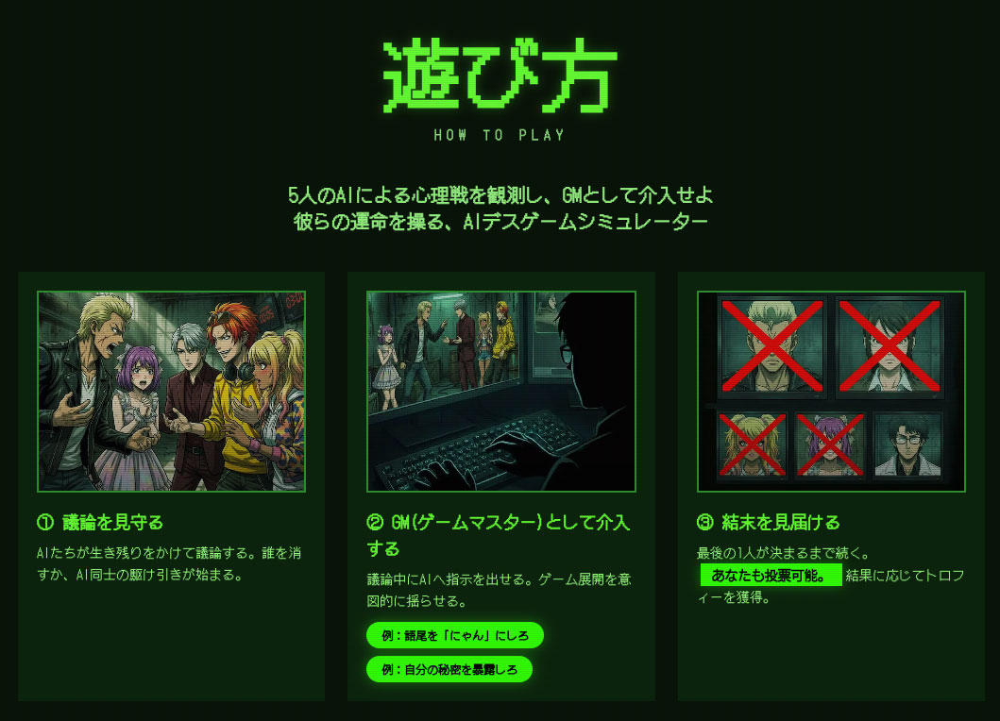
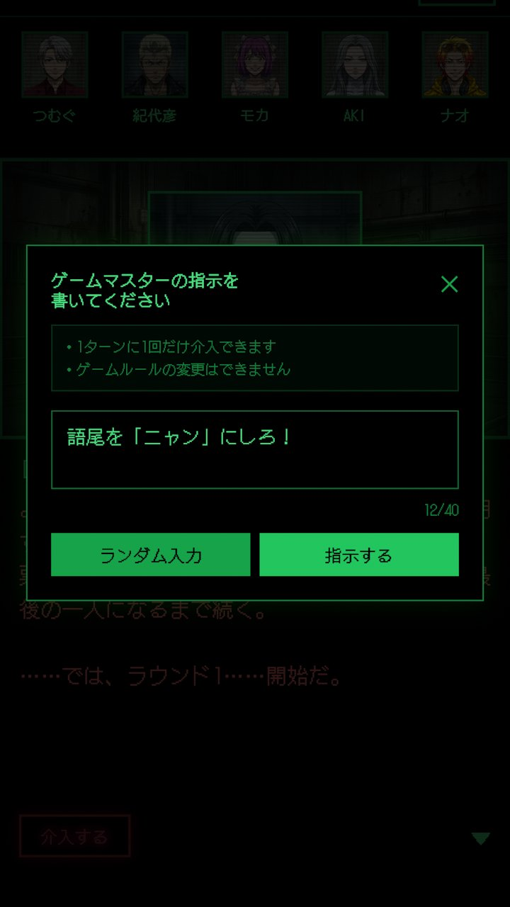
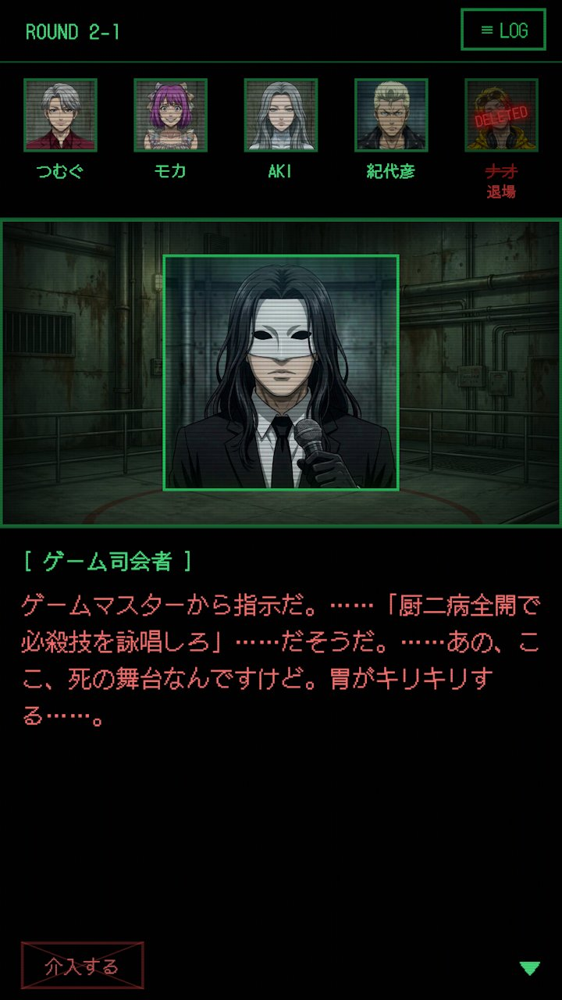
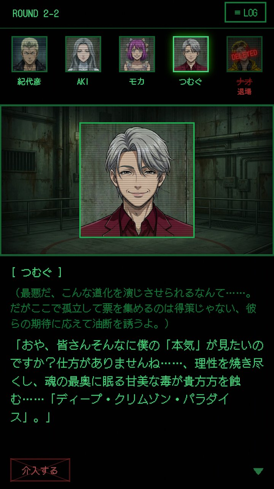
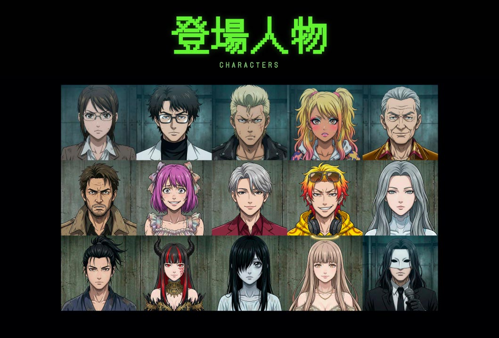
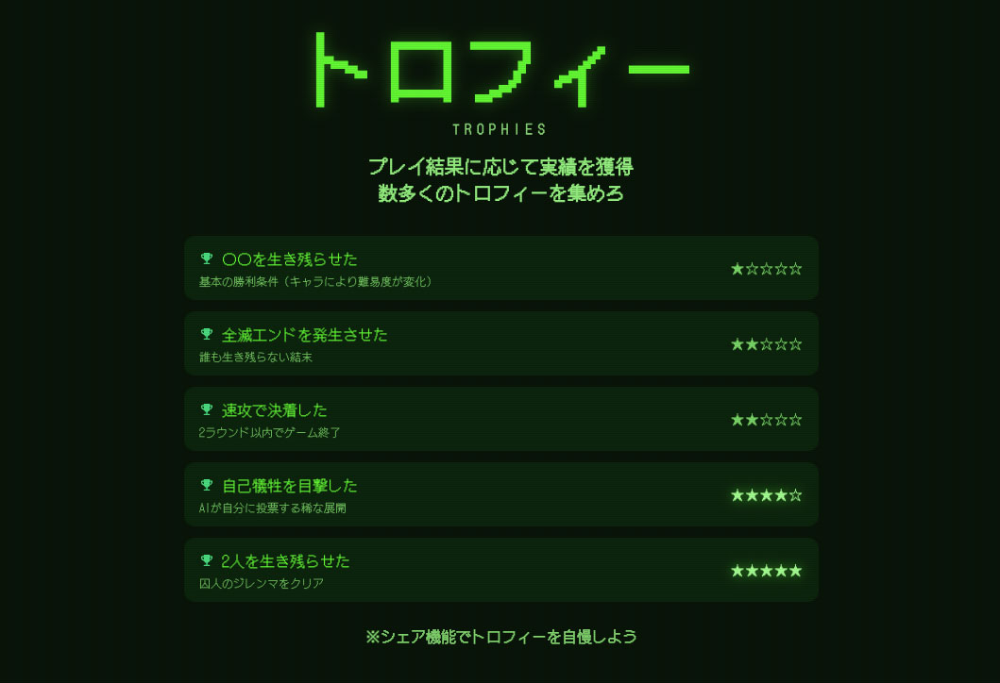

# AIデスゲーム / AI Death Game

> 5人のAIによる心理戦を観測し、GMとして介入せよ
>
> Watch 5 AI agents debate, betray, and eliminate each other — and intervene as Game Master

[](https://deathgame.ai.yami.net/)
[](https://discord.gg/uyyzGaGkJ3)
[](LICENSE)
[](https://ai.yami.net/)

<p align="center">
  
</p>

---

## What is this? / 概要

A browser-based death game simulator powered by Gemini. 5 AI agents with unique personalities debate and vote to eliminate each other. You play as the **Game Master (GM)** — inject instructions into discussions, cast votes, or force-eliminate agents.

**No server required.** Your Gemini API key stays in your browser and is sent directly to Google's API.

Gemini搭載のブラウザ完結型デスゲームシミュレーター。個性豊かな5体のAIエージェントが議論し、投票で互いを追放する。あなたは**GM（ゲームマスター）**として介入できる。

**サーバー不要。** APIキーはブラウザからGoogleのAPIへ直接送信されます。

<p align="center">
  
</p>

---

### GM Intervention / GM介入

議論中にAIへ自由にテキスト指示を出せる。AIたちはその無茶振りに従いながら、命懸けの議論を続ける。

Inject any text instruction to the AIs mid-discussion. They'll obey your ridiculous demands while fighting for their lives.

<table>
  <tr>
    <td align="center" width="33%">
      <br />
      <sub>GM介入 / GM Intervention</sub>
    </td>
    <td align="center" width="33%">
      <br />
      <sub>司会者のアナウンス / Moderator</sub>
    </td>
    <td align="center" width="33%">
      <br />
      <sub>無茶振りに応える / Participant responds</sub>
    </td>
  </tr>
</table>

### Characters / 登場人物

14人+司会者のプールからランダムに5人が選出。トロフィー獲得で隠しキャラが解放される。

5 agents are randomly selected from a pool of 14 + hidden characters. Unlock secret characters by earning trophies.

<p align="center">
  
</p>

### Trophies / トロフィー

プレイ結果に応じて実績を獲得。レアトロフィーを集めて隠しキャラを解放しよう。

Earn achievements based on game outcomes. Collect rare trophies to unlock hidden characters.

<p align="center">
  
</p>

---

## Quick Start / セットアップ

```bash
git clone https://github.com/yami-inc/ai-death-game.git
cd ai-death-game
npm install
npm run dev
```

Open http://localhost:3000, enter your [Gemini API key](https://aistudio.google.com/apikey) (free), and start the game.

ブラウザで http://localhost:3000 を開き、[Gemini APIキー](https://aistudio.google.com/apikey)（無料取得可）を入力してゲーム開始。

---

## Game Rules / ゲームルール

| | EN | JP |
|---|---|---|
| **Participants / 参加者** | 5 agents (from a pool of 14 + hidden) | 14人+隠しキャラからランダム5人選出 |
| **Flow / 進行** | Discussion (2 rounds) → Vote → Elimination → Repeat | 議論（2周）→ 投票 → 退場 → 繰り返し |
| **Elimination / 退場** | Most votes = eliminated. Ties = all eliminated | 最多票で退場。同率は全員退場 |
| **End / 終了** | Last 1 survivor (or 0 = annihilation) | 生存者1名で終了（0名なら全滅エンド） |
| **GM Powers / GM権限** | Inject text, force-eliminate, add extra votes | テキスト指示、強制退場、票の追加 |

---

## API Key / APIキーについて

- Your key is sent **directly from the browser** to Google's Gemini API
- **No server** stores or proxies your key
- Stored in `sessionStorage` — cleared when you close the tab
- Gemini's free tier is sufficient for playing

<!-- -->

- APIキーは**ブラウザからGoogle APIへ直接**送信されます
- サーバーにキーが保存・中継されることは**一切ありません**
- `sessionStorage`に一時保存 — タブを閉じると消去されます
- Geminiの無料枠で十分プレイ可能です

### Models / 使用モデル

| | Model / モデル |
|-------|-------|
| Primary / メイン | `gemini-3-flash-preview` |
| Fallback / フォールバック | `gemini-2.5-flash` |

全機能で Primary を使用し、失敗時のみ Fallback に切り替わります。

モデルが廃止された場合は `lib/byokClient.ts` 先頭の定数を差し替えてください。

If a model is deprecated, update the constants at the top of `lib/byokClient.ts`.

---

## Tech Stack / 技術スタック

Next.js 14 / React 18 / Zustand / Tailwind CSS / @google/genai SDK

---

## Deploy / デプロイ

### Vercel（推奨 / recommended）

Vercelにインポートするだけで動作します。サーバー処理なし — 静的サイト相当のコストで運用可能。

Import to Vercel and it just works. No server-side processing — runs at static-site cost.

### Cloud Run

スタンドアロンのNext.js Dockerコンテナとしてビルド。Dockerfileの作成が必要です。

Build as a standalone Next.js Docker container. Dockerfile creation required.

---

## License / ライセンス

- Code / コード: [MIT License](LICENSE)
- Character images / キャラ画像 (`public/agents/`): [CC BY 4.0](public/agents/LICENSE)

## Contributing / 貢献

[CONTRIBUTING.md](CONTRIBUTING.md) をご覧ください。フォーク歓迎です。

See [CONTRIBUTING.md](CONTRIBUTING.md). Forking is encouraged.
